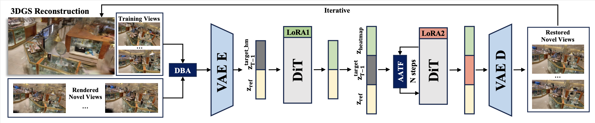
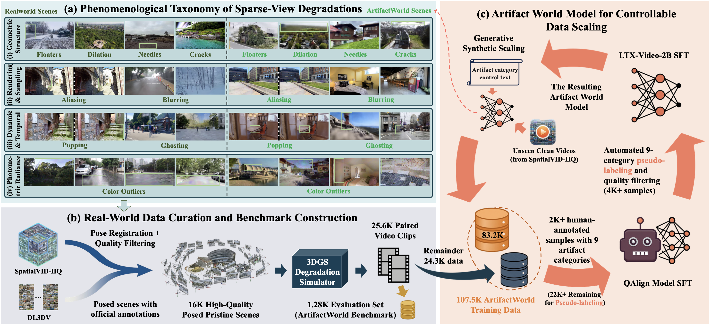

# ArtifactWorld

**ArtifactWorld: Scaling 3D Gaussian Splatting Artifact Restoration via Video Generation Models**

[](https://arxiv.org/abs/2604.12251) [](https://arxiv.org/pdf/2604.12251.pdf) [](https://fyting.github.io/ArtifactWorld/) [](https://huggingface.co/datasets/buaadwxl/ArtifactWorld-Benchmark/tree/main) [](https://huggingface.co/buaadwxl/ArtifactWorld/tree/main) [](https://opensource.org/licenses/Apache-2.0)

Sparse-view 3D Gaussian Splatting (3DGS) often suffers from geometric and photometric degradation. ArtifactWorld scales artifact restoration using **systematic data expansion** and a **homogeneous dual-model** paradigm on a shared video diffusion backbone: a shared-structure predictor estimates an **artifact heatmap** first; at **restoration** time, **Artifact-Aware Triplet Fusion (AATF)** and **Decoupled Boundary Anchoring (DBA)** **work together** inside native self-attention for intensity-guided spatiotemporal repair and improved 3D reconstruction. See the paper: [arXiv:2604.12251](https://arxiv.org/abs/2604.12251) · [PDF](https://arxiv.org/pdf/2604.12251.pdf).

This repository is the **official ArtifactWorld codebase**. It currently ships runnable two-stage inference (`stages/`), benchmark preprocessing, and release configs. Training data and training code will follow in a later release (see News).

## News

- **Released:** Standardized benchmark data [ArtifactWorld-Benchmark](https://huggingface.co/datasets/buaadwxl/ArtifactWorld-Benchmark/tree/main) (`gt.tar` / `artifact.tar`).
- **Released:** Two-stage LoRA weights and AATF auxiliary latents consistent with the paper ([Hugging Face weights](https://huggingface.co/buaadwxl/ArtifactWorld/tree/main), `weights.tar`), plus runnable inference code under `stages/`.
- **Planned:** Large-scale training data (107.5K generative flywheel scale from the paper) and training code.

**License:** This repository’s code is licensed under the **Apache License 2.0** (see `LICENSE` in the repo root). Third-party components under `stages/` retain their own license files (e.g. LTX-Video–related notices).

---

## Method overview

| Paper concept | Default pipeline in this repo |
|---------------|-------------------------------|
| Homogeneous dual model, shared latent space | Stage-1 and Stage-2 build on the same [LTX-Video-Trainer](https://github.com/Lightricks/LTX-Video-Trainer)–style stack and base version |
| Shared-structure predictor → artifact heatmap | **Stage-1:** predicts headmap / noisemap from the reference video (`stage1_pred_headmap_lora.safetensors`) |
| AATF & DBA (jointly at restoration) | **Stage-2:** both operate in the same restoration forward pass; staged fusion on heatmaps and auxiliary latents implements AATF (e.g. `noisemap_blend_weights` in `configs/stage2_infer.yaml`); reference conditioning and related design reflect DBA (see paper Fig. 3) |
| Inference preprocessing | **`tools/process_videos.py`:** merges benchmark `gt` / `artifact` pairs into reference mp4 inputs for Stage-1 and Stage-2 |



## Data

- **Benchmark (released):** [buaadwxl/ArtifactWorld-Benchmark](https://huggingface.co/datasets/buaadwxl/ArtifactWorld-Benchmark/tree/main) — the curated 1.28K subset described on the project page and in the paper.



| Archive | Description |
|---------|-------------|
| `gt.tar` | Ground-truth videos for the benchmark |
| `artifact.tar` | Artifact/degraded videos for the benchmark |

```bash
export HF_ENDPOINT=https://hf-mirror.com   # optional mirror
huggingface-cli download buaadwxl/ArtifactWorld-Benchmark --repo-type dataset --local-dir ./ArtifactWorld-Benchmark
# Extract gt.tar and artifact.tar, e.g. to ./data/gt and ./data/artifact
```

- **Generative flywheel training data (107.5K in the paper):** not shipped in this repo yet; status will be updated in News.

---

## Model weights

- **Hugging Face:** [buaadwxl/ArtifactWorld](https://huggingface.co/buaadwxl/ArtifactWorld/tree/main)

| File | Description |
|------|-------------|
| `weights.tar` | Stage-1 / Stage-2 LoRA checkpoints and auxiliary latents |

Download and extract:

```bash
export HF_ENDPOINT=https://hf-mirror.com   # optional mirror
huggingface-cli download buaadwxl/ArtifactWorld --local-dir ./ArtifactWorld-weights
cd ./ArtifactWorld-weights && tar -xf weights.tar
```

By default, scripts read from the in-repo `weights/` directory. If you unpack elsewhere, set:

```bash
export ARTIFACTWORLD_WEIGHTS_ROOT=/path/to/your/weights
```

The weights root should contain (or adjust `ARTIFACTWORLD_WEIGHTS_ROOT` accordingly):

| File | Description |
|------|-------------|
| `stage1_pred_headmap_lora.safetensors` | Stage-1: artifact heatmap / noisemap prediction (LoRA1) |
| `stage2_noisemap_blend_lora.safetensors` | Stage-2: restoration with AATF and DBA jointly in the model (LoRA2) |
| `auxiliary_latents/z_full.pt` | Stage-2: AATF auxiliary latent (one fusion branch) |
| `auxiliary_latents/z_null.pt` | Stage-2: AATF auxiliary latent (other fusion branch) |

`stage1_infer.yaml` / `stage2_infer.yaml` expose explicit LTX base paths: `scheduler_source`, `tokenizer_source`, `text_encoder_source`, `vae_source`, `transformer_source`. For **directory** roots, the loader **appends standard subfolders** (`tokenizer/`, `text_encoder/`, `vae/`, `scheduler/`, `transformer/`). Point those fields at a **repository root** or **Hugging Face snapshot root**, not at `.../tokenizer` or `.../scheduler`, or you will get doubled subfolders. If `transformer_source` is a path ending in `.safetensors`, it is loaded via `from_single_file` and does **not** append `subfolder="transformer"`.

**Convention:**

| Fields | Root / path to use | Environment variable |
|--------|--------------------|----------------------|
| `tokenizer_source`, `text_encoder_source`, `vae_source` | Root of [Lightricks/LTX-Video](https://huggingface.co/Lightricks/LTX-Video) (or local snapshot with `tokenizer/`, `text_encoder/`, `vae/` directly underneath) | `ARTIFACTWORLD_LTX_MAIN_ROOT` |
| `scheduler_source` | Root of [Lightricks/LTX-Video-0.9.7-dev](https://huggingface.co/Lightricks/LTX-Video-0.9.7-dev) (with `scheduler/` underneath) | `ARTIFACTWORLD_LTX_097_DEV_ROOT` |
| `transformer_source` | Single-file `ltxv-13b-0.9.8-distilled.safetensors` under LTX-Video (e.g. `__LTX_MAIN_ROOT__/ltxv-13b-0.9.8-distilled.safetensors`) | `ARTIFACTWORLD_LTX_MAIN_ROOT` |

```bash
# LTX-Video (tokenizer / text_encoder / vae + 0.9.8 distilled transformer .safetensors)
export ARTIFACTWORLD_LTX_MAIN_ROOT=/path/to/LTX-Video

# LTX-Video-0.9.7-dev (scheduler only)
export ARTIFACTWORLD_LTX_097_DEV_ROOT=/path/to/LTX-Video-0.9.7-dev
```

Defaults if unset:

- `ArtifactWorld-main/weights/LTX-Video`
- `ArtifactWorld-main/weights/LTX-Video-0.9.7-dev` (clone the full repo for `scheduler/`; do not point only at a nested subfolder or you will stack subfolders twice)

**Environment:** Use the same Python environment that has all dependencies installed (e.g. `conda activate ltx_video`, or that env’s `python`). Otherwise you may see missing packages (e.g. `typer`).

Download LTX base weights before inference:

- **VAE + tokenizer + text encoder:** [Lightricks/LTX-Video](https://huggingface.co/Lightricks/LTX-Video/tree/main)
- **Transformer (0.9.8 distilled single file):** place `ltxv-13b-0.9.8-distilled.safetensors` under the LTX-Video root — [blob](https://huggingface.co/Lightricks/LTX-Video/blob/main/ltxv-13b-0.9.8-distilled.safetensors) / [resolve](https://huggingface.co/Lightricks/LTX-Video/resolve/main/ltxv-13b-0.9.8-distilled.safetensors)
- **Scheduler:** [Lightricks/LTX-Video-0.9.7-dev](https://huggingface.co/Lightricks/LTX-Video-0.9.7-dev/tree/main) (clone the whole repo; only `scheduler/` is required for these configs)

---

## Installation

### Conda

Create a Conda (or venv) environment with a Python version matching [LTX-Video-Trainer](https://github.com/Lightricks/LTX-Video-Trainer) (commonly 3.10). Example env name **`ltx_video`**:

```bash
conda create -n ltx_video python=3.10 -y
conda activate ltx_video
```

Then follow upstream [docs/](https://github.com/Lightricks/LTX-Video-Trainer/tree/main/docs) for **CUDA PyTorch** and inference dependencies, or install from this repo’s frozen snapshot `requirements.txt`. For Hugging Face downloads you may set `HF_ENDPOINT` (mirror) and `HF_HOME` (cache directory).

### Python dependencies

Root **`requirements.txt`** is a full dependency snapshot from the release `ltx_video` environment (editable install lines removed). `tools/process_videos.py` additionally requires **`ffmpeg`** on your system `PATH`.

```bash
cd /path/to/ArtifactWorld-main
pip install -r requirements.txt
```

---

## Repository layout

```
ArtifactWorld-main/
├── LICENSE
├── README.md
├── requirements.txt
├── configs/
│   ├── stage1_infer.yaml      # __AW_ROOT__ / __WEIGHTS_ROOT__ / __LTX_*__ expanded by scripts
│   └── stage2_infer.yaml
├── scripts/
│   ├── _common.sh
│   ├── run_stage1_infer.sh
│   ├── run_stage2_infer.sh
│   └── run_pipeline_example.sh
├── tools/
│   └── process_videos.py
├── stages/
│   ├── stage1/
│   │   ├── scripts/validate.py
│   │   └── src/ltxv_trainer/
│   └── stage2/
│       ├── scripts/validate.py
│       └── src/ltxv_trainer/
├── weights/                   # default layout for LoRA + auxiliary_latents
│   ├── stage1_pred_headmap_lora.safetensors
│   ├── stage2_noisemap_blend_lora.safetensors
│   └── auxiliary_latents/
│       ├── z_full.pt
│       └── z_null.pt
├── workspace/                 # optional intermediates
└── outputs/                   # default run outputs (override with --output-folder)
```

---

## Inference

### 1. Build reference videos

Merge **same-named** `gt` and `artifact` mp4 files from the benchmark into Stage-1/2 reference inputs (GT first/last frames + artifact middle + tail alignment).

```bash
python tools/process_videos.py \
  --gt-dir /path/to/gt \
  --artifact-dir /path/to/artifact \
  --output-dir /path/to/processed
```

### 2. Stage-1: heatmap / noisemap

Runs vendored code under `stages/stage1` by default (`LTX_STAGE1_ROOT` overrides):

```bash
conda activate ltx_video   # or your env name
CUDA_VISIBLE_DEVICES=0 ./scripts/run_stage1_infer.sh \
  --input-folder /path/to/processed \
  --output-folder "$(pwd)/outputs/stage1_run"
```

Videos are written to `<output-folder>/samples/` with the same basenames as inputs.

### 3. Stage-2: restoration (AATF + DBA)

Runs vendored code under `stages/stage2` by default (`LTX_STAGE2_ROOT` overrides):

```bash
conda activate ltx_video   # or your env name
CUDA_VISIBLE_DEVICES=0 ./scripts/run_stage2_infer.sh \
  --input-folder /path/to/processed \
  --noisemap-videos-folder "$(pwd)/outputs/stage1_run/samples" \
  --output-folder "$(pwd)/outputs/stage2_run"
```

Restored videos: `<stage2-output>/samples/`.

### One-shot example

```bash
conda activate ltx_video   # or your env name
# export ARTIFACTWORLD_WEIGHTS_ROOT=/path/to/weights   # non-default layout
# export LTX_STAGE1_ROOT=/path/to/external-stage1      # optional
# export LTX_STAGE2_ROOT=/path/to/external-stage2      # optional
export GT_DIR=.../gt
export ARTIFACT_DIR=.../artifact
CUDA_VISIBLE_DEVICES=0 ./scripts/run_pipeline_example.sh
```

---

## Environment variables

| Variable | Meaning |
|----------|---------|
| `ARTIFACTWORLD_WEIGHTS_ROOT` | Optional. Directory containing `stage*.safetensors` and `auxiliary_latents/`; default **`ArtifactWorld-main/weights/`** |
| `ARTIFACTWORLD_LTX_MAIN_ROOT` | Optional. Root of `LTX-Video` (tokenizer / text_encoder / vae + `ltxv-13b-0.9.8-distilled.safetensors`); default `ArtifactWorld-main/weights/LTX-Video` |
| `ARTIFACTWORLD_LTX_097_DEV_ROOT` | Optional. Root of `LTX-Video-0.9.7-dev` (scheduler only); default `ArtifactWorld-main/weights/LTX-Video-0.9.7-dev` |
| `LTX_STAGE1_ROOT` | Optional. Override Stage-1 code root; default `ArtifactWorld-main/stages/stage1` |
| `LTX_STAGE2_ROOT` | Optional. Override Stage-2 code root; default `ArtifactWorld-main/stages/stage2` |
| `CUDA_VISIBLE_DEVICES` | Optional GPU selection |

Launch scripts expand **`__AW_ROOT__`**, **`__WEIGHTS_ROOT__`**, **`__LTX_MAIN_ROOT__`**, and **`__LTX_097_DEV_ROOT__`** in `configs/*.yaml` to absolute paths.

---

## Citation

```bibtex
@article{wang2026artifactworld,
  title   = {ArtifactWorld: Scaling 3D Gaussian Splatting Artifact Restoration via Video Generation Models},
  author  = {Wang, Xinliang and Shi, Yifeng and Wu, Zhenyu},
  journal = {arXiv preprint arXiv:2604.12251},
  year    = {2026},
}
```

---

## Acknowledgements

This codebase builds upon **[LTX-Video-Trainer](https://github.com/Lightricks/LTX-Video-Trainer)**. We thank the authors for their open-source release.
